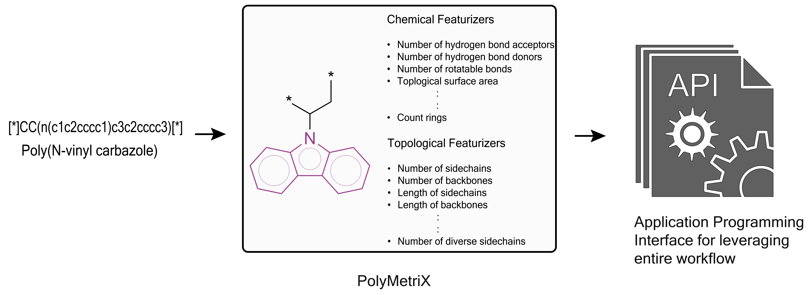

<h1 align="center">
  PolyMetriX
</h1>

<p align="center">
    <a href="https://pypi.org/project/polymetrix">
        
    </a>
    <a href="./LICENSE">
        
    </a>
</p>

<p align="center">
<picture>
  <source media="(prefers-color-scheme: dark)" srcset="./docs/figures/overview-dark.png">
  
</picture>
</p>

*PolyMetriX* is a comprehensive Python library that powers the entire machine learning workflow for polymer informatics. From data preparation to feature engineering, it provides a unified framework for developing structure-property relationships in polymer science.

For more detailed information, see the [documentation](https://lamalab-org.github.io/polymetrix/).

## ✨ Installing PolyMetriX

**Prerequisites**

- **Python 3.10 or newer:**

```bash
pip install polymetrix
```