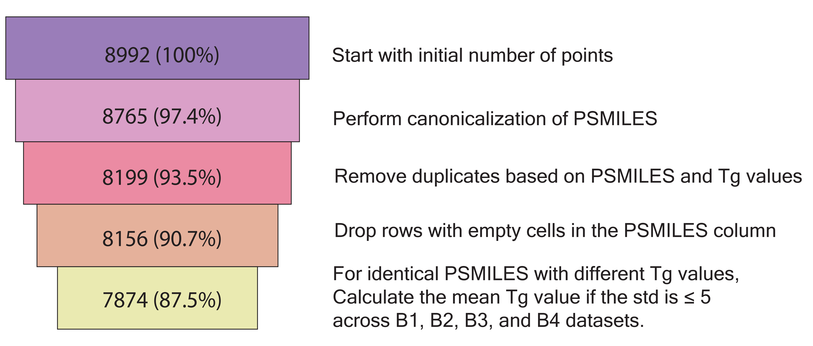
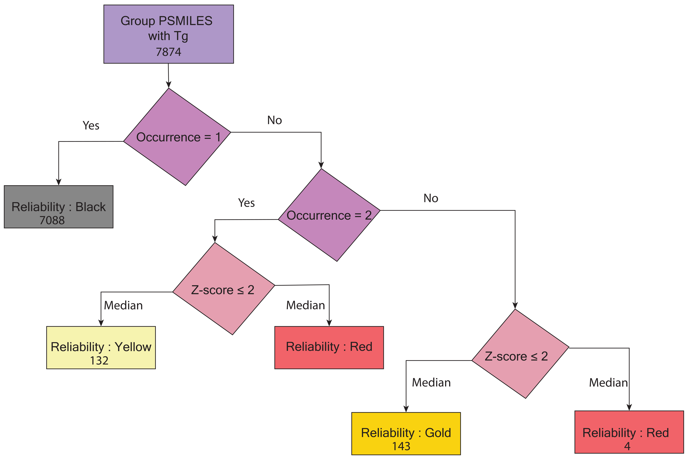

# Datasets

## `CuratedGlassTempDataset`

``` python
from polymetrix.datasets import CuratedGlassTempDataset

dataset = CuratedGlassTempDataset(version, url)

print("Available features:", dataset.available_features)
print("Available labels:", dataset.available_labels)
print("Available metadata:", dataset.meta_info)
```

This will output the list of available features, labels, and metadata for the dataset.


Since, the dataset has been curated for the glass transition temperature (Tg) data for the polymers, the available labels are `labels.Exp_Tg(K)` and the available features are the list of features that are available in the dataset. In addition, this dataset also contains metadata information about the polymer, PSMILES, source, Tg range, number of points, Tg values, reliability, and standard deviation of the data.

The `meta.source` contain the following names of the sources from which the data has been obtained for Tg dataset along with links to the sources:

- `Schrodinger` - [Schrodinger](https://pubs.acs.org/doi/10.1021/acsapm.0c00524)
- `Mattioni` - [Mattioni](https://pubs.acs.org/doi/10.1021/ci010062o)
- `Uchicago` - [Uchicago](https://pppdb.uchicago.edu/tg)
- `Liu` - [Liu](https://link.springer.com/article/10.1007/s00396-009-2035-y)
- `Nguyen` - [Nguyen](https://pubs.acs.org/doi/10.1021/acs.iecr.2c01302)
- `Wu` - [Wu](https://onlinelibrary.wiley.com/action/downloadSupplement?doi=10.1002%2Fpolb.24117&file=polb24117-sup-0001-suppinfo1.pdf)
- `Qiu` - [Qiu](https://github.com/HKQiu/PPP-1_PredictionTg4Polyimides/blob/main/Train%20data/GNN%E6%95%B0%E6%8D%AE%E5%BA%93.csv)
- `GREA` - [GREA]( https://github.com/liugangcode/GREA/blob/main/data/tg_prop/raw/tg_raw.csv)
- `Xie` - [Xie](https://github.com/figotj/Polymer_Tg_/blob/main/Data/32_Conjugate_Polymer.txt)

For the same polymer, different glass transition temperature values are reported from various sources. For this reason, we have considered the median value of the Tg values for the same polymer from these sources as the Tg value listed in the `labels.Exp_Tg(K)` column. Additionally, we have provided the reliability of the data in the `meta.reliability` column. The reliability of the data is assigned on the occurrence of polymer and Z-score ≤ 2. The reliability of the data is categorized into three categories:
- `Black` - This category indicates that the reliability of the data is uncertain because the polymers are unique, and there is limited information available. This is based on our estimate.
- `Yellow` - This category suggests that the data is moderately reliable based on our estimate, as the polymer has two different Tg values from different sources with a Z-score ≤ 2.
- `Gold` - This category means the data is highly reliable because the polymer has more than two different Tg values from different sources and Z-score ≤ 2.
- `Red` - This category indicates that the data is unreliable because the polymer has different Tg values from different sources with a Z-score > 2.

The `meta.tg_range` column contains the range of the glass transition temperature for the polymer for multiple sources. 
The `meta.tg_values` column contains the Tg values for the polymer from different sources in a list.
The `meta.num_of_points` column contains the number of data points for the polymer that has different Tg values from different sources.
The `meta.stdev` column represents the standard deviation of the Tg values for the polymer.

The figures below illustrate the data filtering funnel and the data curation workflow for the glass transition temperature (Tg) dataset. In the data filtering funnel, B1, B2, B3, and B4 represent the sources (`Schrodinger`, `liu`, `Mattioni`, and `Wu`), all of which originated from the Bicerano handbook. We first corrected these sources and then merged the data from all sources to create the curated dataset for the glass transition temperature (Tg) data of polymers.


**Caption 1:** Correction to Bicerano sources


**Caption 2:** Data Curation Workflow